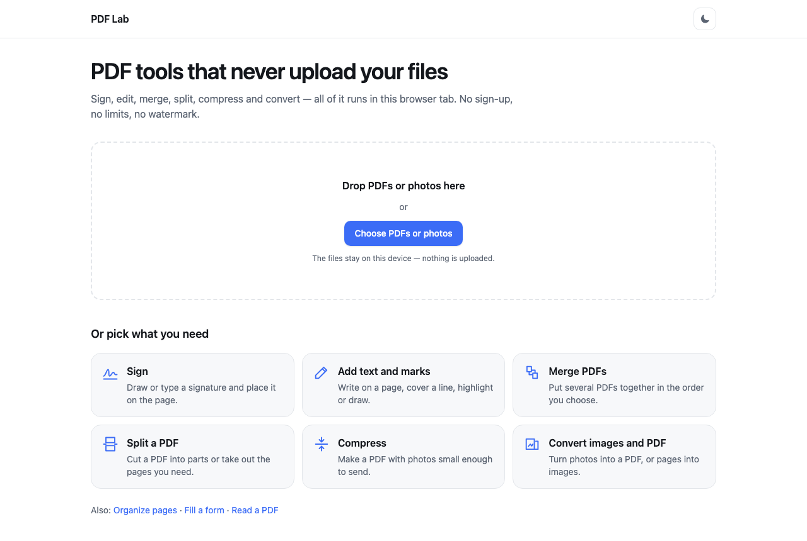
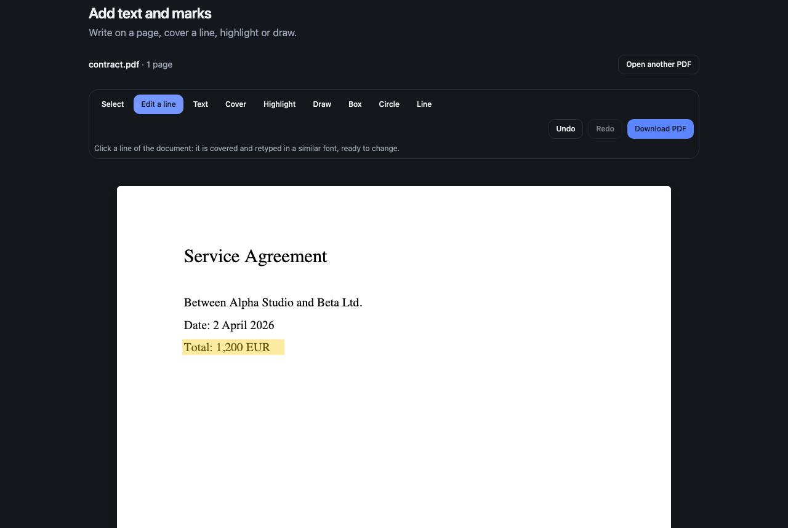

# PDF Lab

**Free PDF tools that never upload your files.** Sign, edit, merge, split, compress and convert — everything runs in the browser tab, so a contract or a passport scan never leaves the device.

**Live:** https://mrnednick.github.io/pdf-lab/



## Tools

| | |
|---|---|
| [Sign](https://mrnednick.github.io/pdf-lab/sign/) | Draw, type or upload a signature, click the page, download. Optionally remembered on this device, with a "forget" button. |
| [Add text and marks](https://mrnednick.github.io/pdf-lab/edit/) | Retype a line in place, add text, highlight, draw, boxes, circles, lines, white-out; undo and redo. |
| [Merge](https://mrnednick.github.io/pdf-lab/merge/) | Several PDFs in the order you drag them into; locked files ask for their password in the list. |
| [Split](https://mrnednick.github.io/pdf-lab/split/) | Ranges like `1-3, 5, 8-` with the wrong piece pointed out, or every page on its own; several parts come as a ZIP. |
| [Compress](https://mrnednick.github.io/pdf-lab/compress/) | Re-saves scans and photos inside the PDF smaller and shows before → after. |
| [Convert](https://mrnednick.github.io/pdf-lab/images/) | Phone photos into a tidy A4 PDF (rotation from the camera applied), or pages into PNG / JPEG at 72–300 dpi. |
| [Organize pages](https://mrnednick.github.io/pdf-lab/organize/) | Reorder, rotate, delete, extract — by dragging thumbnails or from the keyboard. |
| [Fill a form](https://mrnednick.github.io/pdf-lab/fill/) | Real inputs over the form's own fields; save, or make the answers final. |
| [Read a PDF](https://mrnednick.github.io/pdf-lab/view/) | Thumbnails, zoom and a page counter for documents of hundreds of pages. |

A file dropped on the home page goes straight into the tool picked next. Every tool has its own address, title and link preview.



## How it works

- **Nothing leaves the browser.** Pages are drawn with [pdf.js](https://github.com/mozilla/pdf.js) in its own worker; files are written with [pdf-lib](https://github.com/cantoo-scribe/pdf-lib). There is no server.
- **Fast with long documents.** A page holds its exact place from the start and is drawn only when it comes near the screen. In a 200-page document the first page appears in about 0.1 s, memory stays flat while scrolling through all of it, and the longest pause between frames is 17 ms.
- **Only what a page needs is loaded.** The home page script is 71 KB gzipped; pdf.js loads with the first tool, the PDF writer only when something is saved (fetched in the background once a file is open), and the font engine only for text the standard PDF fonts cannot write.
- **"Edit a line"** reads the document's text, joins the pieces pdf.js reports into lines, and on click puts a white box over the line and the same words on the same baseline, at the same size, in the closest font family — ready to change. Text in the standard fonts stays real, searchable text in the result.
- **Any language.** The standard PDF fonts only cover Western European letters; Cyrillic, Greek and the rest are written with an embedded subset of Noto Sans instead of turning into question marks.
- **Signatures** are trimmed to the ink; a photo of a signature on paper gets its paper removed with smooth edges. Typed signatures use a handwriting font that ships with the app, so they look the same on every device.
- **Forms** are read from the PDF's own fields and shown as real inputs exactly over them; the fields themselves are left off the drawing so nothing appears twice.
- **Compression** touches only pictures it can decode and write back faithfully (JPEG and 8-bit RGB / grey) and keeps a picture unless the new one is clearly smaller. An 8-page 300 dpi scan goes from 30 MB to 2.8 MB, with the text still crisp.

### Honest limits

- Retyping covers the old text; it does not edit the original. **Cover hides something on the page, but the text underneath stays in the file** — it is not redaction, and the app says so next to the tool.
- A text-only PDF cannot be made meaningfully smaller. Compress says so instead of offering a "compressed" copy that is not.
- CMYK, palette and masked images are left as they are when compressing.
- No OCR and no conversion to Word.

## Quality

- 45 unit tests (Vitest): page ranges, layout of photos on paper, history, line detection, writing marks and forms, fonts, compression rules.
- End-to-end tests (Playwright) on the production build, desktop and phone: every tool's main scenario, with the downloaded file read back and checked — page order, rotation, text, form values, images, sizes. Any console error fails a test.
- CI runs lint, unit tests, the build and the end-to-end tests on every push; the demo is deployed to GitHub Pages only after all of them pass.
- Keyboard: pages and marks can be selected, moved, rotated and deleted without a mouse; light and dark themes; works from 360 px wide.

## Run it

```bash
npm ci
npm run dev        # http://localhost:5173
npm test           # unit tests
GITHUB_PAGES=true npm run build && npm run e2e   # end-to-end on the production build
```

React 19, TypeScript, Vite, Tailwind CSS.

## Credits

[pdf.js](https://github.com/mozilla/pdf.js) (Apache-2.0), [pdf-lib](https://github.com/cantoo-scribe/pdf-lib) and [fontkit](https://github.com/cantoo-scribe/fontkit) (MIT), [Noto Sans](https://github.com/notofonts/latin-greek-cyrillic) and [Caveat](https://github.com/googlefonts/caveat) (SIL Open Font License, texts in `public/fonts`).
